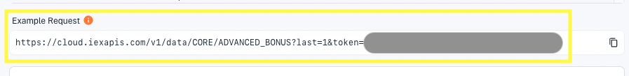

# Using Core Data

> **Note:** IEX Cloud documentation for the legacy plan subscribers is at <https://iexcloud.io/docs/api/>.

Apperate's [production-ready Core Data](./getting-started/production-ready-core-data.md) has REST endpoints and [datasets](./reference/glossary.md#dataset) that you can join with other datasets for creating views.

## Core Datasets

Apperate's built-in historical time series data is available as [datasets](./reference/glossary.md#dataset) (a.k.a. Core Datasets). You can browse them in the console at [**Data > Datasets > Core**](https://iexcloud.io/console/datasets/core).


Each dataset's **Overview** page provides an example request URL that returns the dataset's last record. You can get a dataset's last record by clicking the **Example Request** URL.



For example, clicking on the **CORE.ADVANCED_BONUS** dataset's **Example Request** returns a record like this:

```javascript
[{"countryCode":"US","created":"2022-02-01","currency":"","description":"Global X MSCI China Industrials ETF","exDate":"2022-12-29","figi":"BBG000PYH302","flag":"","fromFactor":0,"lastUpdated":"2022-02-01","notes":null,"parValue":0,"parValueCurrency":"USD","paymentDate":"2023-01-09","recordDate":"2022-12-30","refid":"2433108","securityType":"Exchange Traded Fund","symbol":"CHII","toFactor":0,"id":"ADVANCED_BONUS","key":"CHII","subkey":"2433108","date":1672272000000,"updated":1652531939424.008}]
```

The example request uses Apperate's Data API. You can query Core Datasets use the API's `GET /data/` endpoint or using the `GET /sql-query/:workspace` endpoint. 

To see the query endpoints in action, see these articles:

- [Querying Datasets](./interacting-with-your-data/querying-data/querying-datasets.md)
- [SQL Query with the API](./interacting-with-your-data/querying-data/sql-query-with-the-api.md)

> **Note:** From a dataset's **Database** page, you can query its data, export the query results to a CSV, and share your query in a URL. 

## Core Data Endpoints

Other core data for the following topics is available via REST endpoints.

- Forex / Currencies
- Options
- Futures
- Commodities
- Economic Data
- Rates
- News
- Symbols / Mappings

The endpoints are described in these API Reference sections:

- [IEX Exchange](https://iexcloud.io/docs/iex-exchange)
- [Miscellaneous](https://iexcloud.io/docs/miscellaneous)
- [Reference Data](https://iexcloud.io/docs/reference-data) pages describe getting Core Data that is not time series.

The image below highlights where they are in the API reference navigation.


## What's Next

Apperate's API is easy to use. For starters, visit [Using Apperate's APIs](./interacting-with-your-data/apperate-api-basics.md)

If you haven't already queried the Core Datasets using the Data API, try it out following these articles:

- [Querying Datasets](./interacting-with-your-data/querying-data/querying-datasets.md)
- [SQL Query with the API](./interacting-with-your-data/querying-data/sql-query-with-the-api.md)

If want to combine Core Dataset data with data from other datasets, check out [Creating and Managing Views](./managing-your-data/creating-and-managing-views.md).