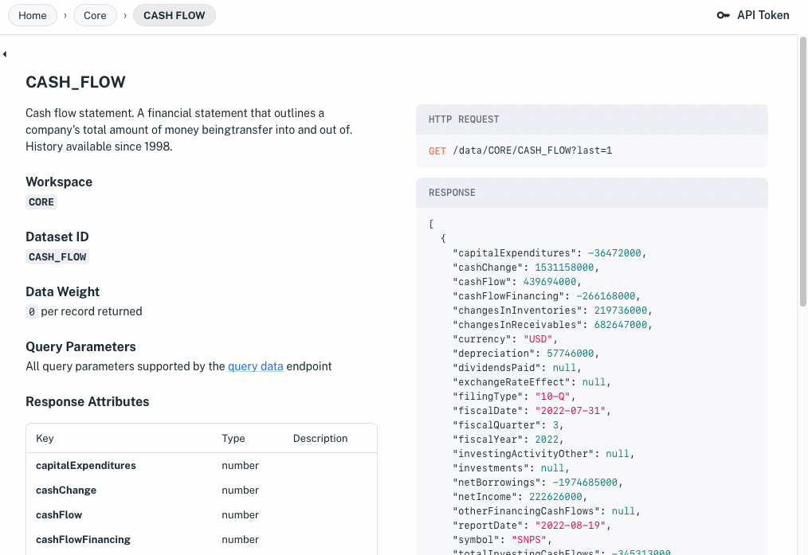
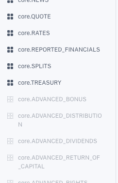
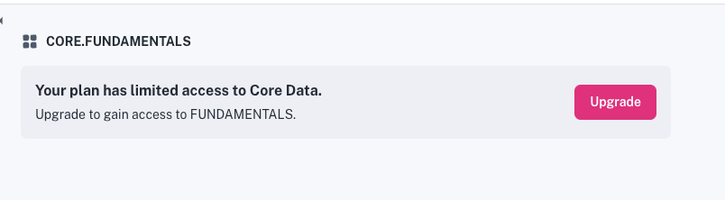

# Use Core Data

```{toctree}
:maxdepth: 1

using-core-data/getting-real-time-core-financial-data.md
using-core-data/getting-time-series-core-financial-data.md
using-core-data/using-normalized-financial-data.md
using-core-data/real-time-delayed-and-intraday-stock-prices.md
using-core-data/rules-engine-event-driven-alerts-and-data-delivery.md
using-core-data/streaming-data-using-sse.md
using-core-data/getting-nasdaq-listed-utp-otc-stock-data.md
using-core-data/finding-symbols.md
```

IEX Cloud comes with 5+ terabytes of built-in financial data to power fintech applications. It includes real-time financial data and historical time series financial data. Both data types are described here.

##  Real-Time Financial Data

```{important} IEX Cloud's financial data API reference is currently split between the current [API Reference](https://iexcloud.io/docs/) and the [Legacy API Reference](https://iexcloud.io/docs/api/). If there is no [Core Data](https://iexcloud.io/docs/core) endpoint page for the data you want, please check the [Legacy API Reference](https://iexcloud.io/docs/api/).
```

The [Legacy API Reference](https://iexcloud.io/docs/api/) describes everything you need to get IEX Cloud real-time financial data.


Here's an overview:

- [Introduction](https://iexcloud.io/docs/api/#introduction) - Covers API basics including authentication, limits, support, how credits work (for legacy plans) and more.
- [Guides](https://iexcloud.io/docs/api/#guides) - Shows how to call REST endpoints and use endpoint data in Microsoft Excel.
- [Developer Tools and Open Source](https://iexcloud.io/docs/api/#developer-tools-and-open-source) - Describes JavaScript and Python SDK libraries.
- [API Usage](https://iexcloud.io/docs/api/#api-usage) - Demonstrates using query parameters, making batch requests, streaming data, and more.
- [Rules Engine](https://iexcloud.io/docs/api/#rules-engine-beta) - Details configuring event-based notifications.
- [Account](https://iexcloud.io/docs/api/#account) - Provides service management information. 
- [API System Metadata](https://iexcloud.io/docs/api/#api-system-metadata) - Links to a live status dashboard and describes the status API.
- [Changelog](https://iexcloud.io/docs/api/#changelog) - Lists notable IEX Cloud data and software changes.
- [Core Data](https://iexcloud.io/docs/api/#core-data) - Describes REST API endpoints for all kinds of financial data, including these:

    - [Stocks / Equities](https://iexcloud.io/docs/api/#stocks-equities)
    - [News](https://iexcloud.io/docs/api/#news)
    - [Cryptocurrency](https://iexcloud.io/docs/api/#cryptocurrency)
    - [Forex / Currencies](https://iexcloud.io/docs/api/#forex-currencies)
    - [Options](https://iexcloud.io/docs/api/#options)
    - [Futures](https://iexcloud.io/docs/api/#futures)
    - [Treasuries](https://iexcloud.io/docs/api/#treasuries)
    - [Commodities](https://iexcloud.io/docs/api/#commodities)
    - [Economic Data](https://iexcloud.io/docs/api/#economic-data)
    - [Rates](https://iexcloud.io/docs/api/#rates)
    - [Mortgage](https://iexcloud.io/docs/api/#mortgage)
    - [Reference Data](https://iexcloud.io/docs/api/#reference-data)
    - [Investors Exchange Data](https://iexcloud.io/docs/api/#investors-exchange-data)

Each endpoint reference includes the HTTP request structure, data weighting (for legacy plans), data timing and schedule, data sources, examples, path/query parameters, and response attributes.

To start calling these endpoints, see [Get Real-Time Financial Data](./using-core-data/getting-real-time-core-financial-data.md).

<!-- TODO - above, reference a legacy financial data article once we create it. - Jim -->

## Historical Financial Data

Apperate's built-in historical time series data is available as [datasets](./reference/glossary.md#dataset) (a.k.a. Core Datasets) that you can [query](./interacting-with-your-data/querying-data/querying-datasets.md) and join with other datasets to [create views](./managing-your-data/creating-and-managing-views.md). The datasets are available in the console at [**Data &rarr; Datasets &rarr; Core**](https://iexcloud.io/console/datasets/core) and in the API Reference at [Core Data](https://iexcloud.io/docs/core).


In the console, each dataset **Overview** page provides an example request URL that you can click to get data from the dataset.

```{note} A dataset's **Database** page (the tab is next to **Overview**) provides a SQL editor for querying the dataset and joining with data from other datasets to create views.
```

The Overview page's **Open Docs** button opens the dataset's `GET /data` endpoint reference page. 



You can query the dataset using the [`GET /data`](https://iexcloud.io/docs/apperate-apis/data/get-data) parameters.

Now you're familiar with Apperate's core financial data.

## Upgrade to Access All Core Data

If you're using Apperate via the free trial plan, some Core datasets are inaccessible (see the grayed-out datasets in the image below).



You can access these datasets by upgrading to a paid plan. To upgrade, click one of the grayed-out datasets and click the **Upgrade** button that appears in the window (see image below). 



Alternatively, you can upgrade your plan at **Account** &rarr; [**Manage Plan**](https://iexcloud.io/console/manage-plan).

## What's Next

[Get Real-Time Financial Data](./using-core-data/getting-real-time-core-financial-data.md) demonstrates querying real-time financial data.

[Get Historical Financial Data](./using-core-data/getting-time-series-core-financial-data.md) shows how to get historical time series financial data.

[Normalized Financial Symbols](./using-core-data/using-normalized-financial-data.md) shows how to query on and join datasets on financial symbols using any supported [financial identifier type](./reference/financial-identifiers.md).

Interested in storing your application data in Apperate? Learn how at [Read and Write Data](../getting-started/write-and-read-a-record.md).