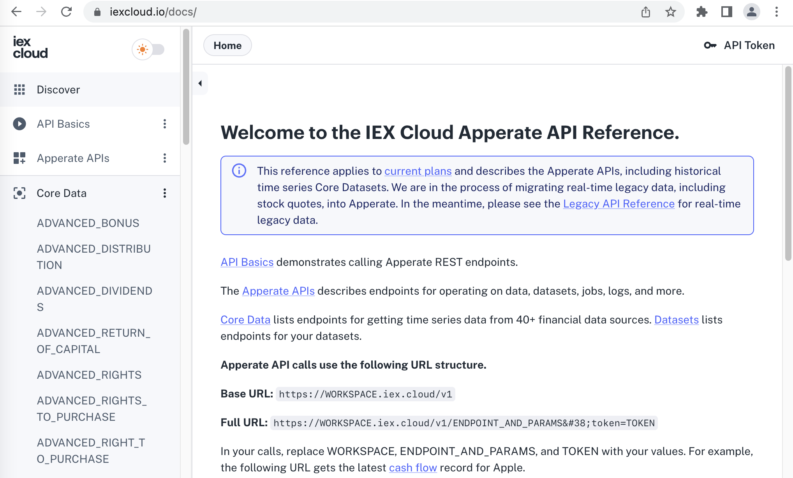
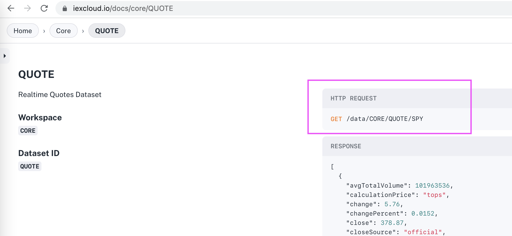
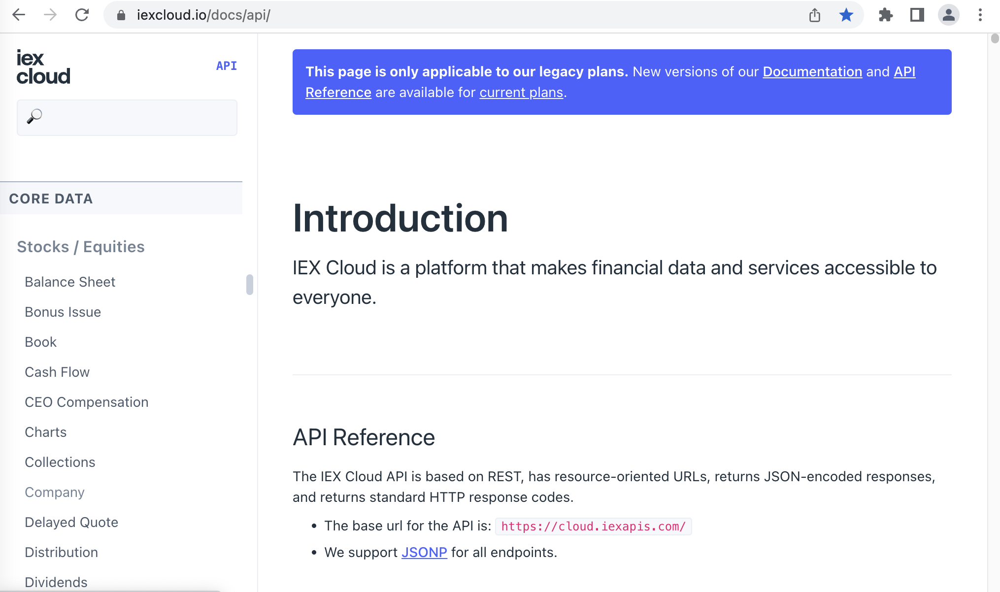
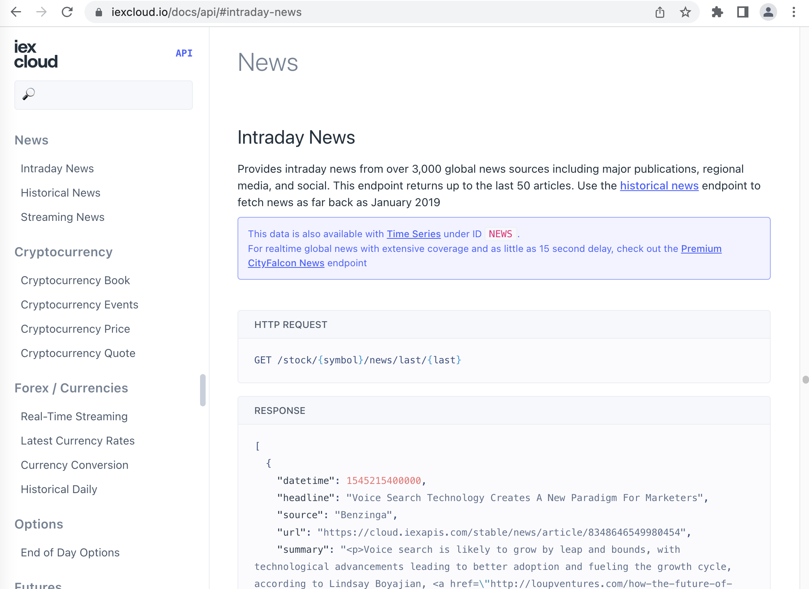

# Get Real-Time IEX Cloud Core Financial Data

IEX Cloud provides real-time data via [IEX Cloud Core Datasets](https://iexcloud.io/docs/core) and the [Legacy API](https://iexcloud.io/docs/api/). 

Here we'll demonstrate getting real-time data from both sources:

- Core Datasets
- Legacy API

**Prerequisites:**

- **IEX Cloud Apperate account** - Create one [here](https://iexcloud.io/cloud-login#/register).

```{important} We are in the process of migrating legacy IEX Cloud Core Data to IEX Cloud Core Datasets in Apperate. IEX Cloud's API reference is currently split between Apperate's [API Reference](https://iexcloud.io/docs/) and the [Legacy API Reference](https://iexcloud.io/docs/api/). If the [API Reference](https://iexcloud.io/docs/) doesn't list the data you want, please check the [Legacy API Reference](https://iexcloud.io/docs/api/).
```

Let's start with Core Datasets

## Core Dataset Example: Get a Quote

IEX Cloud's real-time Core Datasets are accessed via the [Get data](https://iexcloud.io/docs/apperate-apis/data/get-data) endpoint the same way all IEX Cloud Core Datasets are accessed. 

``` {note} **Base URL:** https://YOUR_WORKSPACE.iex.cloud/v1/
```

**Format:**

```
/data/core/DATASET_ID/{key}?token=YOUR_TOKEN
```

**Parts:**

- `/data` specifies the [GET /data](https://iexcloud.io/docs/apperate-apis/data/get-data) method.
- `/core` is the IEX Cloud Core Dataset namespace.
- `/DATASET_ID` identifies the Core Dataset you're accessing.
- `/{key}` is the item you want data for.
- `token=YOUR_TOKEN` is a query parameter for authorizing your request. See [API Tokens](../administration/access-and-security.md).

**Steps:**

Let's get the latest trade price for Apple using the **Quote** dataset.

1. Open the [API Reference](https://iexcloud.io/docs/) in your browser. The API Reference appears.

    

1. Scroll down to **Core Datasets &rarr; [Quote](https://iexcloud.io/docs/core/QUOTE)** and select it. The Quote reference page appears.

    

    The example **HTTP Request** uses the `CORE` workspace's `QUOTE` dataset to get a stock price for a ticker named `SPY`. For `Quote`, the `key` path parameter is a stock ticker.

    ``` {note} The reference page specifies the dataset's **Workspace** and the **Dataset ID** to use in the endpoint request.
    ```

1. You can get Quote data for Apple in your browser using a URL that follows the format below.

    ``` {note} **Base URL:** https://YOUR_WORKSPACE.iex.cloud/v1/
    ```

    **Format:**

    ```
    /data/core/quote/{key}?token=YOUR_TOKEN
    ```

    Enter the URL above and replace `{key}` with `aapl` and `YOUR_TOKEN` with an [API token](../administration/access-and-security.md) that has Core Dataset read permissions.

    **Example:**

    [/data/core/quote/aapl](https://apis.iex.cloud/v1/data/core/quote/aapl)

    The endpoint returns the Apple stock trade price in a JSON object like this one:

    ```javascript
    [
        {
            "avgTotalVolume": 88511396,
            "calculationPrice": "close",
            "change": -4.55,
            "changePercent": -0.03047,
            "close": null,
            "closeSource": "official",
            "closeTime": null,
            "companyName": "Apple Inc",
            "currency": "USD",
            "delayedPrice": null,
            "delayedPriceTime": null,
            "extendedChange": 0.14,
            "extendedChangePercent": 0.00097,
            "extendedPrice": 144.94,
            "extendedPriceTime": 1666961819242,
            "high": 149.046,
            "highSource": "15 minute delayed price",
            "highTime": 1666900799994,
            "iexAskPrice": 0,
            "iexAskSize": 0,
            "iexBidPrice": 0,
            "iexBidSize": 0,
            "iexClose": 144.94,
            "iexCloseTime": 1666961819242,
            "iexLastUpdated": 1666961819242,
            "iexMarketPercent": 0.0014379503866032324,
            "iexOpen": 144.94,
            "iexOpenTime": 1666961819242,
            "iexRealtimePrice": 144.94,
            "iexRealtimeSize": 10,
            "iexVolume": 2625,
            "lastTradeTime": 1666900799474,
            "latestPrice": 144.8,
            "latestSource": "Close",
            "latestTime": "October 27, 2022",
            "latestUpdate": 1666900800311,
            "latestVolume": 1825515,
            "low": 144.13,
            "lowSource": "15 minute delayed price",
            "lowTime": 1666894323125,
            "marketCap": 2327044889600,
            "oddLotDelayedPrice": 144.72,
            "oddLotDelayedPriceTime": 1666900727367,
            "open": null,
            "openTime": null,
            "openSource": "official",
            "peRatio": 23.93,
            "previousClose": 149.35,
            "previousVolume": 88436172,
            "primaryExchange": "NASDAQ",
            "symbol": "AAPL",
            "volume": 0,
            "week52High": 182.19,
            "week52Low": 128.86,
            "ytdChange": -0.2116423937475047,
            "isUSMarketOpen": false
        }
    ]
    ```

    <!-- Uncomment when the API page has the response attributes
    ```{note} The [Quote](https://iexcloud.io/docs/core/QUOTE) reference page describes the response attributes.
    ```
    -->

That's all there is to getting a stock quote! Other real-time endpoints are similar. Just visit their API docs in the [API Reference](https://iexcloud.io/docs/).

Congratulations! You know how to get real-time IEX Cloud Core Data for your apps. 

``` {hint} In the console, if there are grayed-out datasets you want to use, upgrade your plan. To upgrade, click one of the grayed-out datasets and click the **Upgrade** button that appears. Otherwise, upgrade your plan at **Account** &rarr; [**Manage Plan**](https://iexcloud.io/console/manage-plan).
```

``` {note}
If you've upgraded to Apperate from legacy and there isn't an IEX Cloud Core Dataset for the data you're used to using, the data hasn't been migrated to Apperate yet. Continue using it via the [Legacy API](https://iexcloud.io/docs/api/).

If you're new to Apperate and aren't finding data you want, also check the [Legacy API Reference](https://iexcloud.io/docs/api/).
```

## Legacy API Example: Get Intraday News

The Legacy APIs are based on REST, have resource-oriented URLs, and return JSON-encoded responses and standard HTTP response codes.

The [Legacy API Reference](https://iexcloud.io/docs/api/) describes the endpoints for the IEX Cloud Core Data legacy product and for data that has not yet been migrated to Apperate Core Datasets. The reference provides helpful instructions for getting started with the legacy API and working with request parameters and results.

- [Introduction](https://iexcloud.io/docs/api/#introduction) describes the base URL and explains the API conventions. 
- [REST How-To article](https://iexcloud.io/docs/api/#rest-how-to) demonstrates how to call the the Legacy API REST endpoints.
- [API Usage](https://iexcloud.io/docs/api/#api-usage) explains details about parameters, data formats, results, and schemas.
- [Time Series parameters](https://iexcloud.io/docs/api/#time-series) describes historical API time-windowing parameters.
- [Core Data](https://iexcloud.io/docs/api/#core-data) provides endpoint reference pages.

Let's get some real-time data using the Legacy API.

**Steps:**

Here's how to get intra-day news for Apple using the Legacy API's **Intraday News** endpoint.

1. Go to the [Legacy API Reference](https://iexcloud.io/docs/api/). The Legacy API Reference appears.

    

1. Scroll down to the **[Core Data](https://iexcloud.io/docs/api/#core-data) &rarr; News &rarr; [Intraday News](https://iexcloud.io/docs/api/#intraday-news)** link in the navigation tree and click it. The [Intraday News](https://iexcloud.io/docs/api/#intraday-news) endpoint reference page appears.

    

1. Call the endpoint per its parameters. Enter `aapl` as the `{symbol}` parameter value for Intraday News endpoint.

    ``` {note} **Base URL:** https://YOUR_WORKSPACE.iex.cloud/v1/
    ```

    **Format:**

    ```
    /stock/{symbol}/news?token=YOUR_TOKEN
    ```

    **Example:**

    [/stock/aapl/news](https://apis.iex.cloud/v1/stock/aapl/news)

    The endpoint responds with a JSON object like this one:

    ```javascript
    [
        {
            "datetime": 1666958400000,
            "headline": "Apple Is Latest to Show We''re Getting Tired of Subscriptions - CNET",
            "source": "CNET",
            "url": "https://cloud.iexapis.com/v1/news/article/7oRu2ppNBjZXhb8Dm3J21hbH5x533CnGFqn8xU0Go5J",
            "summary": "Its services business, including Apple TV Plus and Apple Music, seemed invincible. But growth is slowing.",
            "related": "AAPL",
            "image": "https://cloud.iexapis.com/v1/news/image/7oRu2ppNBjZXhb8Dm3J21hbH5x533CnGFqn8xU0Go5J",
            "lang": "en",
            "hasPaywall": false
        },
        {
            "datetime": 1666957871000,
            "headline": "Big Tech is getting wiped out in a brutal 3rd-quarter earnings season – but Apple isn’t. Here’s why.",
            "source": "Business Insider Nederlands",
            "url": "https://cloud.iexapis.com/v1/news/article/LJCEwiA9Wi6iTi8tm4cepX7kVMKU8U5sBsUtMWJIsWs",
            "summary": "Big Tech stocks have plunged this week on the back of disappointing quarterly earnings. Apple stock was spared because the iPhone maker''s results beat analysts'' forecasts. The consumer-electronics giant may have been saved by its brand power and wealthy customer base. Lackluster earnings from some of America''s largest technology companies have led to hundreds of billions of dollars being wiped from their market values this week. But Apple''s brand power and the affluence of its customers have helped it to impress Wall Street and escape a similar post-report selloff, analysts said. Alphabet shares tumbled 10% on Wednesday, Meta''s stock price plunged 25% on Thursday, and Amazon shares fell as much as 21% in after-hours trading on Thursday. Moreover, Microsoft shares slumped 8% on Thursday. In contrast, Apple''s stock inched up 1% in premarket trading Friday. The iPhone maker is also faring better than its peers on a year-to-date basis. Its stock price was only down 20% as of Thursday''s close, while Microsoft, Amazon, and Alphabet shares have slumped by more than 30%, Netflix has tanked 50%, and Meta has plummeted by about 70%. \"Apple has not cracked like the other tech firms, and shows how it can be done,\" Ben Barringer, an equity research analyst at Quilter Cheviot, said in a morning note.",
            "related": "AAPL,MSFT,MSF-GD,MSF-GS,MSF-GH,MSF-GM,MSF-GF,MSF-GB,MSF-GY,MSF-GI,KO,CCH-LN,NFLX,BRK.A,BRK.B,AMZN,GOOG,GOOGL,META",
            "image": "https://cloud.iexapis.com/v1/news/image/LJCEwiA9Wi6iTi8tm4cepX7kVMKU8U5sBsUtMWJIsWs",
            "lang": "en",
            "hasPaywall": false
        },
        // ... continues with more news entries
    ]
    ```

Now you know how to get financial data from the Legacy API when you need to.

```{note} Make sure to check [IEX Cloud Core Datasets](https://iexcloud.io/docs/core) and the [Changelog](../reference/changelog.md) for newly migrated data.
```

## Related Topics

[Use Normalized Financial Data](./using-normalized-financial-data.md)

[Real-Time Delayed and Intraday Stock Prices](./real-time-delayed-and-intraday-stock-prices.md)

[Rules Engine Event Driven Alerts and Data Delivery](./rules-engine-event-driven-alerts-and-data-delivery.md)

[Stream Data Using SSE](./streaming-data-using-sse.md)

[Get Nasdaq Listed UTP and OTP Stock Data](./getting-nasdaq-listed-utp-otc-stock-data.md)

[Find Financial Symbols](./finding-symbols.md)

[Get Historical IEX Cloud Core Financial Data](./getting-time-series-core-financial-data.md)