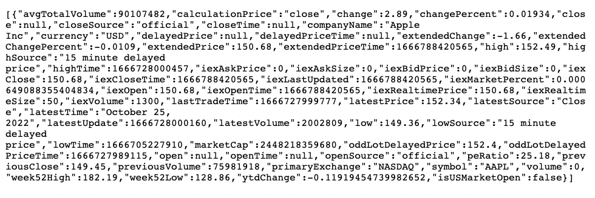
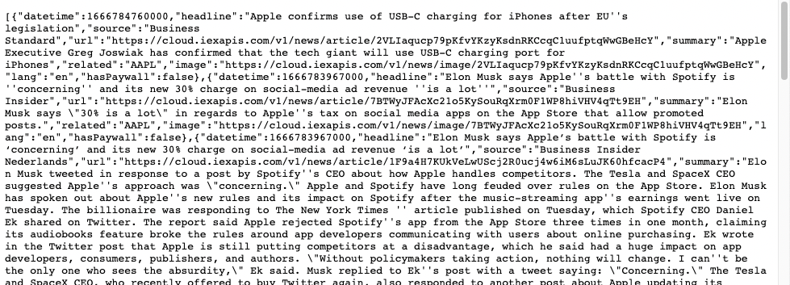

# Get Real-Time IEX Cloud Core Financial Data

IEX Cloud provides real-time data via [IEX Cloud Core Datasets](https://iexcloud.io/docs/core) and the [Legacy API](https://iexcloud.io/docs/api/). 

Here we'll demonstrate getting real-time data from both sources:

- Core Datasets
- Legacy API

**Prerequisites:**

- **IEX Cloud Apperate account** - Create one [here](https://iexcloud.io/cloud-login#/register).

```{important} IEX Cloud's API reference is currently split between the current [API Reference](https://iexcloud.io/docs/) and the [Legacy API Reference](https://iexcloud.io/docs/api/). If there is no [IEX Cloud Core Dataset](https://iexcloud.io/docs/core) endpoint for the data you want, please check the [Legacy API Reference](https://iexcloud.io/docs/api/).
```

Let's start with IEX Cloud Core Datasets

## Get a Quote From Core Datasets

IEX Cloud's real-time Core Datasets are accessed via the [Get data](https://iexcloud.io/docs/apperate-apis/data/get-data) endpoint the same way all IEX Cloud Core Datasets are accessed. 

**Format:**

```
https://YOUR_WORKSPACE.iex.cloud/v1/data/core/DATASET_ID/:key?token=YOUR_TOKEN
```

**Parts:**

Here each part is explained:

- `https://YOUR_WORKSPACE.iex.cloud/v1` is the **base URL**.
- `/data` specifies the [GET /data](https://iexcloud.io/docs/apperate-apis/data/get-data) method.
- `/core` is the IEX Cloud Core Dataset namespace.
- `/DATASET_ID` identifies the dataset you're accessing.
- `/:key` is the item you want data for.
- `token=YOUR_TOKEN` is a query parameter for authorizing your request. See [API Tokens](../administration/access-and-security.md).

**Steps:**

Let's get the latest trade price for Apple using the **Quote** dataset.

1. Open the [API Reference](https://iexcloud.io/docs/) in your browser. The API Reference appears.

    

1. Scroll down to **Core Datasets &rarr; [Quote](https://iexcloud.io/docs/core/QUOTE)** and select it. The Quote reference page appears.

    

    The example **HTTP Request** uses the `CORE` workspace's `QUOTE` dataset to get a stock price for a ticker named `SPY`. For `Quote`, the `:key` path parameter is a stock ticker.

    ``` {note} The reference page specifies the dataset's **Workspace** and the **Dataset ID**, to use in your endpoint request.
    ```

1. You can get Quote data for Apple in your browser using a URL that follows the format below.

    **Format:**

    ```
    https://YOUR_WORKSPACE.iex.cloud/v1/data/core/quote/aapl?token=YOUR_TOKEN
    ```

    Enter the URL above and replace `YOUR_WORKSPACE` and `YOUR_TOKEN` with your workspace name and an API token with IEX Cloud Core Dataset read permissions.

    **Example:**

    <https://apis.iex.cloud/v1/data/core/quote/aapl>

    The endpoint returns the Apple stock trade price in a JSON object response like this one:

    

    <!-- Uncomment when the API page has the response attributes
    ```{note} The [Quote](https://iexcloud.io/docs/core/QUOTE) reference page describes the response attributes.
    ```
    -->

That's all there is to getting a stock quote! Other real-time endpoints are similar. Just visit their API docs in the [API Reference](https://iexcloud.io/docs/).

Congratulations! You know how to get real-time IEX Cloud Core Data for your apps. 

``` {hint} In the console, if there are grayed-out datasets you want to use, upgrade your plan. To upgrade, click one of the grayed-out datasets and click the **Upgrade** button that appears. Otherwise, upgrade your plan at **Account** &rarr; [**Manage Plan**](https://iexcloud.io/console/manage-plan).
```

``` {note}
If you've upgraded to Apperate from legacy and there isn't an IEX Cloud Core Dataset for the data you're used to using, the data hasn't been migrated to Apperate yet. Continue using it via the [Legacy API](https://iexcloud.io/docs/api/).

If you're new to Apperate and aren't finding data you want, also check the [Legacy API Reference](https://iexcloud.io/docs/api/).
```

## Get Intraday News From the Legacy API

The Legacy APIs are based on REST, have resource-oriented URLs, and return JSON-encoded responses and standard HTTP response codes.

The [Legacy API Reference](https://iexcloud.io/docs/api/) describes the endpoints for the IEX Cloud Core Data legacy product. It provides helpful instructions for getting started with the legacy API and working with request parameters and results.

- [Introduction](https://iexcloud.io/docs/api/#introduction) describes the base URL and explains the API conventions. 
- [REST How-To article](https://iexcloud.io/docs/api/#rest-how-to) demonstrates how to call the the Legacy API REST endpoints.
- [API Usage](https://iexcloud.io/docs/api/#api-usage) explains details about parameters, data formats, results, and schemas.
- [Time Series parameters](https://iexcloud.io/docs/api/#time-series) describes historical API time-windowing parameters.
- [Core Data](https://iexcloud.io/docs/api/#core-data) provides endpoint reference pages.

Let's get intra-day news for Apple using the Legacy API's Intraday News endpoint:

1. Go to the [Legacy API Reference](https://iexcloud.io/docs/api/#core-data). The Legacy API Reference appears.

    

1. Scroll down to the **Core Data &rarr; News &rarr; [Intraday News](https://iexcloud.io/docs/api/#intraday-news)** link in the navigation tree and click it. The [Intraday News](https://iexcloud.io/docs/api/#intraday-news) endpoint reference page appears.

    

1. Call the endpoint per its parameters. Use your workspace name in your base URL (or use the `https://cloud.iexapis.com/v1` base URL), and enter `aapl` as the path parameter for Intraday News endpoint.

    **Format:**

    ```
    https://YOUR_WORKSPACE.iex.cloud/v1/stock/aapl/news
    ```

    **Example:**

    <https://cloud.iexapis.com/v1/stock/aapl/news>

    ``` {note} Historical data endpoints use time series parameters. An endpoint API page mentions the [Time Series parameters](https://iexcloud.io/docs/api/#time-series) if that endpoint uses them.
    ```

    A JSON object response result like this one appears:

    

Now you know how to get financial data from the Legacy API when you need to.

```{note} Make sure to check [IEX Cloud Core Datasets](https://iexcloud.io/docs/core) for newly migrated data.
```

## Related Topics

[Use Normalized Financial Data](./using-normalized-financial-data.md)

[Real-Time Delayed and Intraday Stock Prices](./real-time-delayed-and-intraday-stock-prices.md)

[Rules Engine Event Driven Alerts and Data Delivery](./rules-engine-event-driven-alerts-and-data-delivery.md)

[Stream Data Using SSE](./streaming-data-using-sse.md)

[Get Nasdaq Listed UTP and OTP Stock Data](./getting-nasdaq-listed-utp-otc-stock-data.md)

[Find Financial Symbols](./finding-symbols.md)

[Get Historical IEX Cloud Core Financial Data](./getting-time-series-core-financial-data.md)