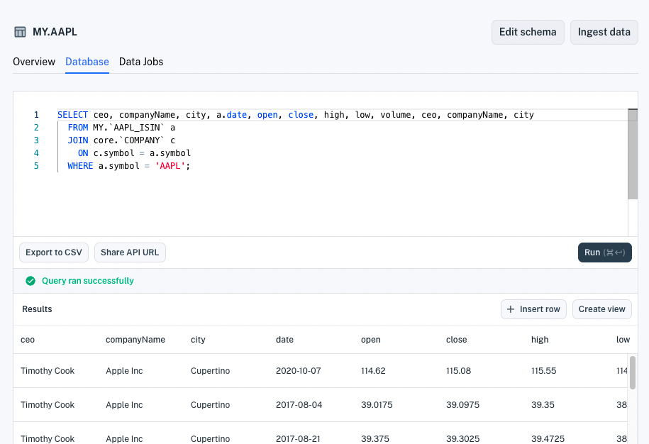

# Normalized Financial Symbols

In Apperate, you can refer to an equity symbol using any supported [financial identifier type](../../reference/financial-identifiers.md). Apperate relates equivalent symbols across different identifier types. You can, for example, use a CUSIP symbol to query datasets that store symbols in ISIN, FIGI, or another supported identifier type. Apperate, in effect, *normalizes* the financial identifiers.

Subscribing to the financial identifier data would cost you tens of **thousands of dollars annually**. Implementing a mapping between the identifiers is complicated and time-consuming. **We have the financial identifiers and normalized all the symbols for you, so you can concentrate on your business logic.**

Here we'll demonstrate two things:

- Querying normalized symbols
- Joining datasets on normalized symbols

## Querying Normalized Symbols

You can query normalized financial datasets using symbols of *any* supported [financial identifier type](../../reference/financial-identifiers.md). For example, the following dataset uses the ISIN [financial identifier type](../../reference/financial-identifiers.md) for its `symbol` column values. It refers to Apple using the `US0378331005` ISIN symbol.


You can, however, query the dataset refering to Apple via its `AAPL` INET symbol because INET is a supported [financial identifier type](../../reference/financial-identifiers.md). 

Here is a SQL query and HTTP request that use the INET symbol `AAPL` to query for Apple data in a dataset that uses ISIN symbols.

**SQL Query:**

```sql
SELECT * FROM MY.`AAPL_ISIN` a where a.symbol='AAPL';
```

**REST API URL:**

```
https://my.iex.cloud/v1/data/WORKSPACE/AAPL_ISIN/AAPL?token=TOKEN
```

**REST API URL Response:**


You can similarly join datasets on normalized symbol data.

## Joining Datasets on Normalized Symbols

You can, for example, create a view of Apple high, open, low, close data and corporate details by joinging this AAPL_ISIN dataset with the Core COMPANY dataset. Here's the SQL.

**SQL Query:**

```sql
SELECT ceo, companyName, city, a.date, open, close, high, low, volume, ceo, companyName, city
  FROM MY.`AAPL_ISIN` a
  JOIN core.`COMPANY` c
    ON c.symbol = a.symbol 
  WHERE a.symbol = 'AAPL';
```

**Results:**



``` {important} WHERE clauses and ON clauses must only operate on indexed properties (columns). See the Unique Index components [here](../managing-your-data/understanding-datasets.md#indexing-with-unique-index).
```

You can then create a view from the results by clicking **Create view**. Voila! You're view dataset is available to use like any other dataset.

## What's Next

When you're ready to share the dataset publicly, you can create an access token for it. See [Access and Security](../../administration/access-and-security.md).

Want to connect with the Core datasets? Browse them at **Data &rarr; Datasets &rarr; [Core](https://iexcloud.io/console/datasets/CORE)**.