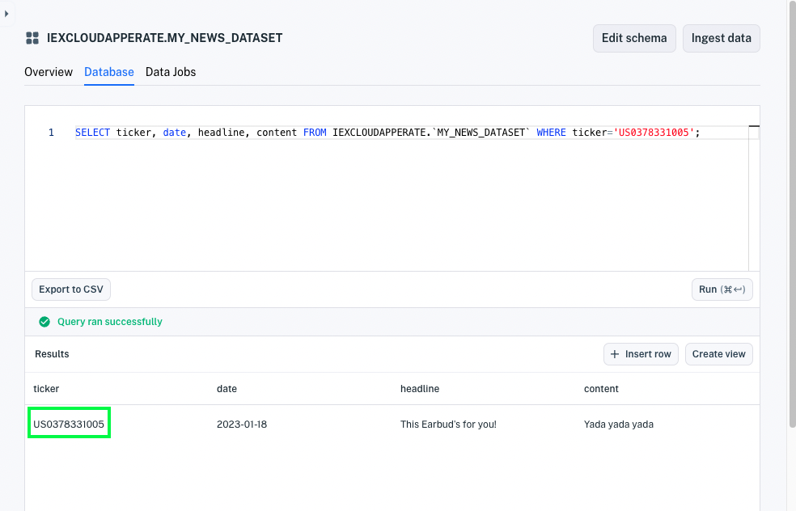

# Normalized Financial Symbols

In Apperate, you can refer to an equity symbol using any supported [financial identifier type](../../reference/financial-identifiers.md). Apperate relates equivalent symbols across different identifier types. You can, for example, use a CUSIP symbol to query datasets that store symbols in FIGI, ISIN, or another supported identifier type. Apperate, in effect, *normalizes* the financial identifiers.

Subscribing to the financial identifier data would cost you tens of **thousands of dollars annually**. Implementing a mapping between the identifiers is complicated and time-consuming. **We have the financial identifiers and normalized all the symbols for you, so you can concentrate on your business logic.**

Here we'll demonstrate two things:

- Querying normalized symbols
- Joining datasets on normalized symbols

## Querying Normalized Symbols

You can query normalized financial datasets using symbols of *any* supported [financial identifier type](../../reference/financial-identifiers.md). For example, the following dataset uses the FIGI [financial identifier type](../../reference/financial-identifiers.md) for its `ticker` column values. It refers to Apple using the `US0378331005` FIGI symbol.



You can, however, query the dataset refering to Apple as `AAPL`. 

Here is a SQL query and HTTP request that use the `AAPL` symbol to query for Apple data in a dataset that uses FIGI symbols.

**SQL Query:**

```sql
SELECT * FROM IEXCLOUDAPPERATE.`MY_NEWS_DATASET` where ticker='AAPL';
```

**REST API URL:**

```
https://IEXCLOUDAPPERATE.iex.cloud/v1/data/IEXCLOUDAPPERATE/IEXCLOUDAPPERATE_NEWS_DATASET/AAPL?token=TOKEN
```

**REST API URL Response:**

```javascript
[
  {
    "content": "Yada yada yada",
    "date": "2023-01-18",
    "headline": "This Earbud's for you!",
    "source": "IEX Underground",
    "ticker": "US0378331005"
  }
]
```

You can similarly join datasets on normalized symbol data.

## Joining Datasets on Normalized Symbols

You can, for example, create a view of Apple high, open, low, close data and corporate details by joinging this AAPL_FIGI dataset with the Core COMPANY_HISTORICAL dataset. Here's the SQL.

**SQL Query:**

```sql
SELECT a.ticker, c.ceo, c.companyName, c.city, a.date, a.headline, a.content
  FROM IEXCLOUDAPPERATE.`MY_NEWS_DATASET` a
  JOIN core.`COMPANY` c
    ON c.symbol = a.ticker 
  WHERE a.ticker = 'AAPL';
```

**Results:**


``` {important} WHERE clauses and ON clauses must only operate on indexed properties (columns). See the Unique Index components [here](../managing-your-data/understanding-datasets.md#indexing-with-unique-index).
```

You can then create a view from the results by clicking **Create view**. Voila! Your view dataset is available to use like any other dataset.

## What's Next

Create a view from the query. See [Create a View](../managing-your-data/create-a-view.md) to learn how.

Want to connect with the Core datasets? Browse them at **Data &rarr; Datasets &rarr; [Core](https://iexcloud.io/console/datasets/CORE)**.