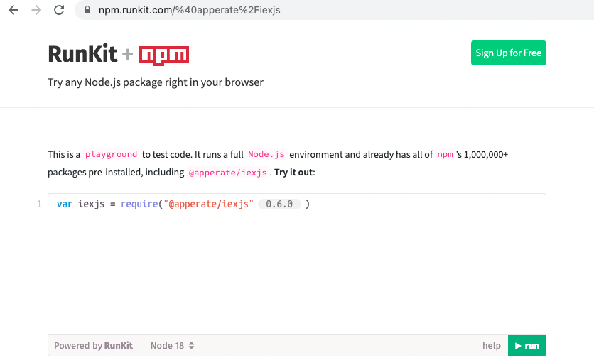

# Write Data with the apperate.write() JS Method

Apperate's [iex.js JavaScript library](../developer-tools/iexjs-library.md) (iexjs) makes writing data a snap by wrapping Apperate's [Data API](https://iexcloud.io/docs/apperate-apis/data/) in JavaScript methods. The `apperate.write()` iexjs method is optimized for writing small amounts of data (e.g., one or a few records) quickly. You can use the method synchronously or asynchronously.

**Asynchronous (default):** The method returns immediately--Apperate saves your data, queues it, and shortly therafter makes it available to query. This is the fastest way to write data and the best way to make multiple data writes simultaneously.

**Synchronous (`wait: true`):** The method blocks until the data is written and available to query. This way assures that the data can be queried once the method returns.

The `apperate.write()` method takes an object array (specified using JSON) as input and creates data records from the objects.

For example, you could write a news event using an array like this one:

```javascript
[
    {
        "headline": "New mobile device makes big splash!",
        "content": "blah blah blah ...",
        "ticker": "AAPL",
        "source": "IEX Underground",
        "date": "2022-07-13"
    },
    {
        "headline": "Space traveler bids are stacking up",
        "content": "You may know some of these celebrities and billionares ...",
        "ticker": "AMZN",
        "source": "IEX Underground",
        "date": "2022-07-14"
    }
]
```

``` {note} The object array can include as many objects as you like; though the write method is intended for writing one or a few records in real time. [Load Data](../load-data.md) describes recommended ways for writing large numbers of records in a single call.
```

``` {note} The *apperate.write()* method doesn't guarantee the ordering of records.
```

``` {note} The *apperate.write()* method doesn't write to any logs. If records fail validation, consider [*loading* the records](../load-data.md) instead. After attempting to load records, you can view invalid records in the validation logs--See the load options at [Loading Data](../load-data.md).
```

Let's write the data above.

## Write Data with apperate.write()

Here's how to write data using the `apperate.write()` [iexjs](https://www.npmjs.com/package/@apperate/iexjs) JavaScript library method.

1. Open an npmjs environment, such as [RunKit](https://npm.runkit.com/%40apperate%2Fiexjs).

    

    Optionally, you can install iexjs with [npm](https://www.npmjs.com) and use iexjs locally:
    
    ```bash
    npm i @apperate/iexjs
    ```

1. Copy the following code into your editor and replace the CAPITALIZED parameter values mentioned below. 

    **Code:**

    ```javascript
    const {Client} = require("@apperate/iexjs")
    const client = new Client({api_token: "SECRET_TOKEN", version: "VERSION"});
    client.apperate.write({
        workspace: "WORKSPACE", 
        id: "DATASET", 
        createDatasetOnDemand: true, 
        data: [
            {"headline": "New mobile device makes big splash!", "content": "blah blah blah ...", "ticker": "AAPL", "source": "IEX Underground", "date": "2022-07-13" },
            {"headline": "Space traveler bids are stacking up", "content": "You may know some of these celebrities and billionaires ...", "ticker": "AMZN", "source": "IEX Underground", "date": "2022-07-14"}]})
            .then((res) => {
                console.log(res);
        });
    ```

    The first two lines of code import the iexjs `Client` definition and instantiate it. The `apperate.write` method call writes data from the `data` parameter into the target dataset specified by the `id` and `workspace` parameters. The `createDatasetOnDemand: true` setting (optional) instructs Apperate to create the dataset if it doesn't exist already.

    **Replace in the Code**

    | Placeholder | Replace with ... |
    | --- | --- |
    | `SECRET_TOKEN` | Your [secret API token](../reference/glossary.md#secret-token-secret-key) |
    | `VERSION` | Apperate API version (`v1` is the current version) |
    | `WORKSPACE` | Your [workspace](../reference/glossary.md#workspace) name |
    | `DATASET` | Target dataset ID (the ID of an existing dataset to populate or a new dataset to create) |

    ``` {seealso} The [Write Data](https://iexcloud.io/docs/apperate-apis/data/write-data) reference page describes the underlying POST /record method and its parameters.
    ```

1. Run the code. Apperate writes the data record to the target dataset and returns a response like this:

    ```javascript
    {success: true, message: "wrote 2 messages"}
    ```

    If the dataset doesn't exist already, Apperate creates a new dataset, giving it the name you specified and inferring its schema from the data you provided.

Here's what the response looks like in RunKit.


You can check for the new data in your dataset many different ways, including querying for the data in the dataset's Database page or [querying the dataset](../search-data/querying-datasets.md) in your browser.

That was fast and easy, right?! Congratulations on writing data to Apperate!

## What's Next

Now that you know how to write data, here are some topics to consider next:

[Search Data](../search-data.md): These articles show various ways to query data.

[Managing Your Data](../managing-your-data.md): These guides explain dataset schema fundamentals, creating views, and creating datasets via the  Datasets API.

[Production-Ready IEX Cloud Core Financial Data](../getting-started/production-ready-core-data.md): Introduces Apperate's 5+ terabytes of built-in financial data available for enriching your fintech applications.

[Load Data](../load-data.md): These tutorials show you how to load data from a URL, an AWS S3 bucket, and more.